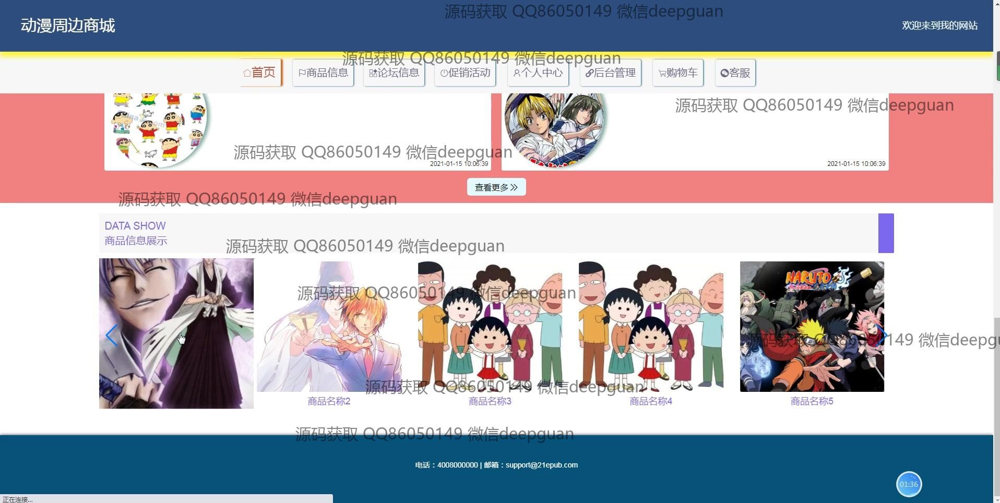
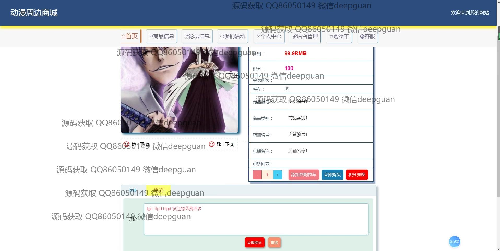
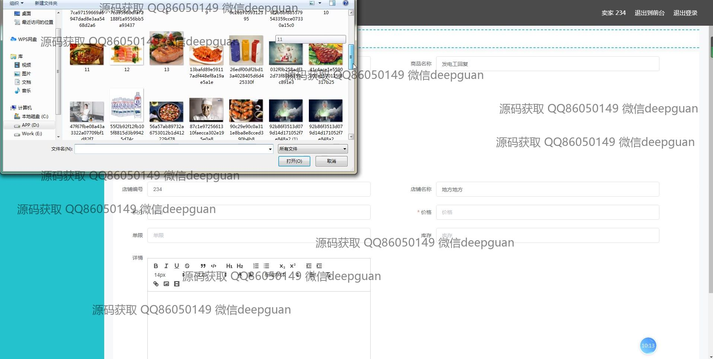

<h1 align="center">的动漫周边商城vue</h1>

## 简介
动漫周边商城：角色分为管理员、用户、卖家；功能包括商品信息管理、订单管理、用户管理、购物车、在线支付、评论论坛、促销活动和店铺管理。    --计算机毕业设计源码；毕设源码；java毕业设计源码

## 联系方式

<h3 align="center">获取完整代码与数据库文件 + 微信：deepguan QQ: 86050149 QQ群: 783742310</h3>

<h3 align="center">可帮忙远程部署 包运行成功！提供远程部署、修改代码、设计文档指导、代码讲解等服务！</h3>

## 功能介绍（完整见运行截图）
管理员：提供登录、注册和退出功能，主导航栏包括商品信息、论坛、促销活动、和后台管理。能够管理用户、订单、商品信息、发货物流、库存及轮播图。提供查看和处理订单的详细信息的功能，包括编辑和删除选项。管理员界面设计简洁，以便于操作。

用户：可以登录、注册、退出，首页包含商品展示、促销信息和论坛互动功能。用户可以浏览商品、查看商品详细信息，加入购物车并进行结算，完成模拟在线支付。个人中心提供查看和管理个人信息、订单、地址和收藏的功能。用户还可以通过论坛与其他用户互动。

卖家：提供店铺信息的管理功能，可以输入商品信息、上传图片、设置价格和库存，管理订单和物流信息。卖家可登录系统查看店铺订单详情及编辑商品信息。卖家界面简洁，帮助有效管理店铺。

游客：无需登录即可浏览商城首页及部分商品信息。游客可查看商品列表及其详细信息。鼓励游客注册以享受购物、加入购物车和参与论坛互动等更多功能。

## 运行截图

本代码来源于网络,仅供学习参考使用!

